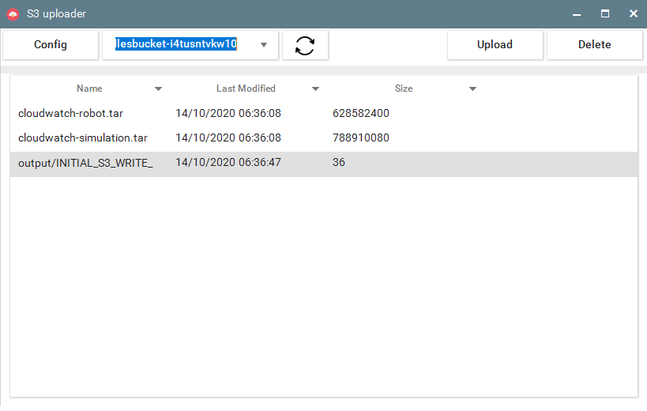
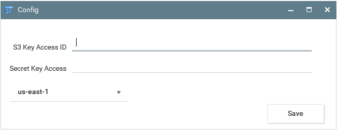
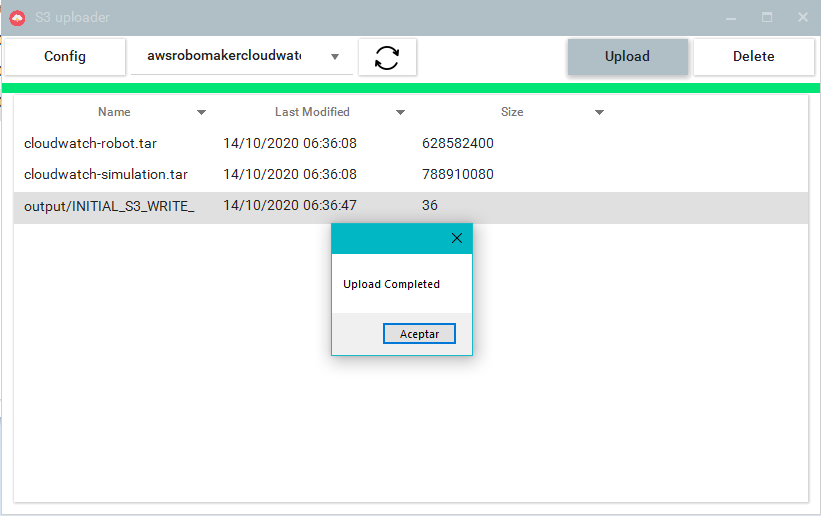

# UploaderS3
<!-- PROJECT LOGO -->
 
<h3 align="center">S3 Uploader Files</h3>

  

 
  

   See , upload or delete files on S3:
  

<!-- ABOUT THE PROJECT -->
## About The Project

**A small project that I started out of lack of inspiration while working on another. (this is how i'm inspired) may not update again. good day ;***

  

 
  

  
  
### Built With

* Telerik WinForms
* C# WinFoms
* Amazon S3
